# Práctica 5 - Objetos, clases e interfaces

```
Autor: XueMei Lin
Curso: 2021- 2022
Universidad: Universidad de La laguna
Asignatura: Desarrollo de Sistemas Informaticos
Herramienta: Visual Studio Code
Lenguaje de programción: TypeScipt
```

## 1. Introducción
El objeto en TypeScript nos permite definir tipos de datos personalizados con la composición de nuestra elección. Y El uso de las clases también es muy importante en TypeScript, ya que una clase es como una estructura predefinida que sirve como molde para crear Objetos.

## 2. Objetivos
El objetivo de la practica 5, vamos a aprender como crear clases, y cómo a partir de una clases cómo crear un objeto de la clase. Además, en las clases vamos a crear atributos y métodos, con el fin de realizar una serie de ejercicios de programación que nos permitirán conocer más en profundidad los objetos, clases e interfaces del lenguaje TypeScript.

## 3. Ejercicios propuestas

### 3.1. Ejercicio 1 - Tablas de multiplicar


Este ejercicio consiste en crear dos clases, por un lado la clase de Pokémon `Class pokedex`, donde guarda la información de los contrincantes.
- Nombre del Pokemon
- Peso 
- Altura
- Tipo
- Estadísticas básicas: ataque, defensa, velocidad, daño máximo (HP).  

La información de cada pokemon puede encontrar [aquí](https://pokemondb.net/pokedex/all).

***Clase Pokedex***

```
export class Pokedex {
    private name:string;
    private weight:number;
    private height:number;
    private type:string;
    private info = Array(4);

    /**
     * _Constructor de la clase Pokedex_
     * @param name nombre de pokemon
     * @param weight peso de pokemon
     * @param height altura de pokemon
     * @param type tipo de pokemon
     * @param info informacion que contiene ataque, defensa, velocidad, HP de pokemon
     */
    constructor(name:string, weight:number, height:number, 
        type:string, info:number[]) {
            this.name = name;
            this.weight = weight;
            this.height = height;
            this.type = type;
            this.info = info;
        }

    //getters para devuelver las variables
    getName() { return this.name; }
    getWeight() { return this.weight; }
    getHeight() { return this.height; }
    getType() { return this.type; }
    getAttack() { return this.info[0]; }
    getDefense() { return this.info[1]; }
    getSpeed() { return this.info[2]; }
    getHP() { return this.info[3]; }

    setHp(Hp:number){ this.info[3] = Hp; }

    //metodo para mostrar la informacion de pokemon
    public showPokemon(){
        console.log(`>> Informacion de ` + this.getName() +
                  `\n>> Tipo: ` + this.getType() + 
                  `\n>> Peso: ` + this.getWeight() + 
                  `\n>> Altura: ` + this.getHeight() +
                  `\n>> HP: ` + this.getHP() +
                  `\n>> Ataque: ` + this.getAttack() +
                  `\n>> Defensa: ` + this.getDefense() +
                  `\n>> Velocidad: ` + this.getSpeed()
        );
    }
```


Por otro lado la clase de `Combat` donde realiza la batalla entre dos contrincantes. 

Más concretamente, en la clase `Combathe creado constructor` `PokemonGame()` donde compara el daño que realiza cada pokemon y un metodo `start()` que realiza el proceso de batalla.

En la funcion `pokemonGame` tiene parametros `pokemon1` `pokemn2` `daño de pokemon1` `depensa de pokemon2`. Dependiendo de los tipos de pokemon, el metodo calcula el daño realizado de `pokemo1` a `pokemon2`.

***Clase Combat***

***Metodo pokemonGame()***
```
private pokemonGame(pokemon_attacker:string, pokemon_defender:string, attack:number, defense:number):number{
        let efectiveness: number = 0;
        let damage_total: number = 0;

        if(pokemon_attacker == pokemon_defender){
            efectiveness = 0.5;
        }else{
            switch(pokemon_attacker){
                case "fire":
                    if(pokemon_defender == "grass"){
                        efectiveness = 2;
                    }else if(pokemon_defender == "water"){
                        efectiveness = 0.5;
                    }else{
                        efectiveness = 1;
                    }
                case "water":
                    if(pokemon_defender == "fire"){
                        efectiveness = 0.5;
                    }
                    if(pokemon_defender == "grass" || pokemon_defender == "electric"){
                        efectiveness = 2;
                    }
                case "grass":
                    if(pokemon_defender == "fire"){
                        efectiveness = 0.5;
                    }else if(pokemon_defender == "electric"){
                        efectiveness = 1;
                    }else{
                        efectiveness = 2;
                    }
                case "electric":
                    if(pokemon_defender == "fire" || pokemon_defender == "grass"){
                        efectiveness = 1;
                    }else{
                        efectiveness = 2;
                    }
            }
        }
        
        damage_total = 50 * ( attack / defense ) * efectiveness;
        
        return parseFloat(damage_total.toFixed(0));
    }
```

y por otro lado el código de `start()`, el combate empieza la batalla entre dos pokemon, Tras varias rondas, si la vida de uno de ellos es negativo o 0, el ganador es el otro pokemon.

***Metodo start()***
```
public start():string {
        console.log(`----------------------------Pokemon Game Start----------------------------\n`);
        console.log(`Historia temporal: 
        Después de salir el bosque negro, tú con tú pokemon "${this.pokemon1.getName()}" estáis yendo 
        al camino No.1 para encontrar tu compañero, en este momento salio un nuevo pokemon 
        "${this.pokemon2.getName()}"`);

        console.log(`\n-------- Tu pokemon: --------`);
        this.pokemon1.showPokemon();

        console.log(`\n-------- Pokemon enemigo: --------`);
        this.pokemon2.showPokemon();
        
        console.log(`\n----------------------------Proceso de combate----------------------------\n`);

        let pokemon1Hp:number = this.pokemon1.getHP();
        let pokemon2Hp:number = this.pokemon2.getHP();
        let round:number = 1;
        
        while (pokemon1Hp > 0 || pokemon2Hp > 0) {
            let damage:number = 0;
            console.log(`\n>> Round: ${round}`);
                
            if(round % 2 != 0) {
                damage = this.pokemonGame(this.pokemon1.getType(), this.pokemon2.getType(), this.pokemon1.getAttack(), this.pokemon2.getDefense());
                console.log(`>> Pokemon "${this.pokemon1.getName()}" ha realizado daño ` + damage + ` a "${this.pokemon2.getName()}"`);
                pokemon2Hp -= damage;
                console.log(`>> Pokemon atacador "${this.pokemon1.getName()}" queda ${pokemon1Hp} hp`);
                console.log(`>> Pokemon defensor "${this.pokemon2.getName()}" queda ${pokemon2Hp} hp`);
            }else{
                damage = this.pokemonGame(this.pokemon2.getType(), this.pokemon1.getType(), this.pokemon2.getAttack(), this.pokemon1.getDefense());
                console.log(`>> Pokemon "${this.pokemon2.getName()}" ha realizado daño ` + damage + ` a "${this.pokemon1.getName()}"`);
                pokemon1Hp -= damage;
                console.log(`>> Pokemon atacador "${this.pokemon2.getName()}" queda ${pokemon2Hp} hp`);
                console.log(`>> Pokemon defensor "${this.pokemon1.getName()}" queda ${pokemon1Hp} hp`);
            }
            if(pokemon1Hp < 0) {
                console.log(`\n>> Ganaste la batalla!! Puedes contener ${this.pokemon2.getName()} usando Poké Ball.`);
                return this.pokemon1.getName();
            }else if(pokemon2Hp < 0){
                console.log(`\n>> Perdiste el combate, tu pokemon ${this.pokemon1.getName()} vuelve a su Poké Ball.`);
                return this.pokemon2.getName();
            }else {
                round++;
            }
        }
        return this.pokemon1.getName();
    }
```


### 3.1. Ejercicio 2 - Conecta 4

El juego conect4 consiste en crear una rejilla de 6 filas y 7 columnas, dos jugadores se turnan para ir colocando un conjunto de fichas dejándolas caer por alguna de las siete columnas de la rejilla. Cada jugador dispone de un total de 21 fichas de un color diferente.

En cada turno, una ficha tomará la primera posición libre de la columna seleccionada por el jugador que corresponda. Si la columna está completa, esto es, ya cuenta con seis fichas, dicha columna no podrá ser seleccionada por ninguno de los dos jugadores para dejar caer otra ficha.

En la implementacion del juego. He creado 3 clases:
    **- class Grid**
    **- class Player**
    **- class connect4**


***Clase Grid***
```
export class Grid {

    private rows:number = 6;
    private cols:number = 7;
    private grid:number[][] = [];
    private saveLastPos = Array(7);
    private countRound:number = 0;
    private ValueI:number = 0;

    constructor() {
        for(let i: number = 0; i < this.rows; i++) {
            this.grid[i] = [];
            for(let j: number = 0; j < this.cols; j++) {
                this.grid[i].push(0);
            }
        }
    }
    
    public getCols() { return this.cols; }
    public getRows() { return this.rows; }
    public getValueI() { return this.ValueI; }
    public getGrid() { return this.grid; }

    public showGrid() {
        console.log(`>> Mostrar Regilla`)
        for(var i: number = 0; i < this.rows; i++) {
            console.log(`${this.grid[i]}`);
        }
    }

    public isValid(colums:number) :boolean {
        if(this.grid[0][colums] == 0) {
            return true;
        }else{
            console.log(`Error, ${colums} está completa`);
            return false;
        }
    }

    public setPosAndGetI(colums:number):number{
        this.countRound++;
            
        //Obtener la i posicion que inserta el jugador
        const getLastPosI = this.getLastPositionOfColumns(colums);
        console.log(`la ultima = ${getLastPosI}`);
        this.ValueI = getLastPosI;
        // impar toca el jugador 1 - par toca el jugador 2
            if(this.countRound % 2 != 0) {
                this.grid[getLastPosI][colums] = 1;
            }else{
                this.grid[getLastPosI][colums] = 2;
            }

        //Actualizar la ultima nueva posicion
        this.saveLastPos[colums] = getLastPosI;
        // console.log(`la ultima = ${getLastPosI}`);
        return this.ValueI;
    }

    private getLastPositionOfColumns(colums:number):number {
        if(this.saveLastPos[colums] == null) {
            return 5;
        }else{
            return this.saveLastPos[colums]-1;
        }
    }
}
```
En primer lugar, inicializamos el constructor a una regilla de 6 * 7 a todos 0. Tiene un metodo `showGrid()` para mostrar la regilla. 
El metodo `isValid()` tiene un parametro que esl numero de columna que inserta el jugador, dicho metodo comproba que si la columna es valida, si es valida, guarda la ultima posicion de la columna o devuelve un valor que es la posicion de fila cuando si es valida la columna. 
Y el metodo `getLastPositionOfColumns` simplemente devuelve la ultima posicion de cada columna (cada position está guardada en una array). 

***Clase Player***
```
export class Player {
    private name:string;
    private numFichas:number = 21;

    constructor(name:string) {
        this.name = name;
    }

    getName() { return this.name; }
    getNumFichas() { return this.numFichas; }

    setNumFichas(numFichas:number) { this.numFichas = numFichas}

}
```
La `class player` es muy sensilla, puesto que el constructor solo recibe el nombre de jugador, y tiene **getters()** para mirar numero de fichas y el nombre de jugador. y `setNumFichas()` sirve para actualizar el numero de fichas despues de cada ronda.

***Clase Connect4***
```
export class GameConect4 {

    private player1:Player;
    private player2:Player;
    private grid:Grid;

    constructor(jugador1:Player, jugador2:Player, regilla:Grid) {
        this.player1 = jugador1;
        this.player2 = jugador2;
        this.grid = regilla;
    }
    
    public gamePlayConect4() {
        // Game start
        console.log(`---------------------------------Bienvenido al juego Conecta 4-----------------------------`); 
    
        this.grid.showGrid();
        console.log(`\n>> Empieza el jugador "${this.player1.getName()}"`);
        let round:number = 1;
        let winnerPlayerA:boolean = false;
        let winnerPlayerB:boolean = false;
        var scanf = require('scanf');

        // while(winnerPlayerA == false && winnerPlayerB == false) {
        while(winnerPlayerA == false && winnerPlayerB == false && this.player1.getNumFichas() > 0 && this.player2.getNumFichas() > 0 ) {

            console.log(`>> Rounda [${round}] ----------------------------------------------------------\n`);
            
            if(round % 2 != 0) {
                console.log(`>> Hola jugador ${this.player1.getName()}. \n>> Ahora es su turno, qué columna quieres insertar una ficha?`);
                
                //para entrar al bucle while, si la columna no es valido, vuelva a insertar. 
                let valido:boolean = false;
                
                while(valido == false) {
                    console.log(`>> Indica un numero entre 0-6`);
                    var colums = scanf('%d');
                    console.log(`>> Usted ha insertado una ficha en la columna ${colums}.`);
                    if(this.grid.isValid(colums)) {
                        console.log(`>> La columna ${colums} es valida`);
                        console.log(`>> El jugador ${this.player1.getName()} pone una ficha en la columa ${colums}`);
                        
                        // Disminuir el numero de fichas
                        this.player1.setNumFichas(this.player1.getNumFichas()-1);
                        console.log(`>> El jugador ${this.player1.getName()} queda ${this.player1.getNumFichas()} fichas.`);
    
                        //Pasar la poscion actual para analizar
                        winnerPlayerA = this.gameWinner(this.grid.setPosAndGetI(colums), colums);
                        valido = true;
                    }else{
                        console.log(`>> El jugador debe volver a poner una ficha.`);
                        valido = false;
                    }
                }
            }else{
                console.log(`>> Hola jugador ${this.player2.getName()}. \n>> Ahora es su turno, qué columna quieres insertar una ficha?`);
                
                //para entrar al bucle while, si la columna no es valido, vuelva a insertar. 
                let valido:boolean = false;

                while(valido == false) {
                    console.log(`>> Indica un numero entre 0-6`);
                    var colums = scanf('%d');
                    console.log(`>> Usted ha insertado una ficha en la columna ${colums}.`);

                    if(this.grid.isValid(colums)) {
                        console.log(`>> La columna ${colums} es valida`);
                        console.log(`>> El jugador ${this.player2.getName()} pone una ficha en la columa ${colums}`);
                        
                        // Disminuir el numero de fichas
                        this.player2.setNumFichas(this.player1.getNumFichas()-1);
                        console.log(`>> El jugador ${this.player2.getName()} queda ${this.player2.getNumFichas()} fichas.`);
    
                        //Pasar la poscion actual para analizar
                        winnerPlayerB = this.gameWinner(this.grid.setPosAndGetI(colums), colums);

                        valido = true;
                    }else{
                        console.log(`>> El jugador debe volver a poner una ficha.`);
                        valido = false;
                    }
                }
            }
            // Mostrar regilla cada vez;
            this.grid.showGrid();

            // Comprobar que haya ganado uno de ellos
            if(winnerPlayerA == true) {
                console.log(`${this.player1.getName()} ha ganado el partido.`);
            }else if(winnerPlayerB == true) {
                console.log(`${this.player2.getName()} ha ganado el partido.`);
            }else{
            }
            round++;
        }
    }


    /**
     * _Metodo que comprobar que si la posicion actual se puede en contrar 4 fichas seguidas_
     * @param posActualI posicion horizontal para analizar que si haya ganado o no
     * @param posActualJ posicion vertical para analizar que si haya ganado o no
     */
    public gameWinner(posActualI:number, posActualJ:number):boolean {
        let winner:boolean = false;
        let countToken:number;

        //hay que hacer 4 bucle for para comprobar

        //horizontal
        countToken = 0;
        for(let i:number = 0; i < this.grid.getCols()-1; i++) {
            if(this.grid.getGrid()[posActualI][i] == 0) {
                continue;
            }else if(this.grid.getGrid()[posActualI][posActualJ] == this.grid.getGrid()[posActualI][i]) {
                if(this.grid.getGrid()[posActualI][i] == this.grid.getGrid()[posActualI][i+1]){
                    countToken++;
                    if(countToken==3) {
                        winner = true;
                    }
                }
            }else{
                continue;
            }
        }

        //vertical
        countToken = 0;
        for(let i:number = posActualI; i < this.grid.getRows()-1; i++) {
            if(this.grid.getGrid()[i][posActualJ] == 0) {
                continue;
            }else if(this.grid.getGrid()[posActualI][posActualJ] == this.grid.getGrid()[i][posActualJ]) {
                if(this.grid.getGrid()[i][posActualJ] == this.grid.getGrid()[i+1][posActualJ]){
                    countToken++;
                    if(countToken==3) {
                        winner = true;
                    }
                }
            }else{
                continue;
            }
        }


        //diagonal izq
        countToken = 0;
        let initCountPosI_izq:number = 0;
        let initCountPosJ_izq:number = posActualI + posActualJ;
        
        // Calcula la posicion diagonal inicial 
        if(initCountPosJ_izq < this.grid.getRows()) {
            initCountPosI_izq = 0;
        }else{
            initCountPosI_izq = initCountPosJ_izq - this.grid.getRows();
            initCountPosJ_izq = this.grid.getCols()-1;
        }
        for(let i:number = initCountPosI_izq, j:number = initCountPosJ_izq; i < this.grid.getRows()-1; i++, j--) {
            if(this.grid.getGrid()[i][j] == 0) {
                continue;
            }else if(this.grid.getGrid()[i][j] == this.grid.getGrid()[i+1][j-1]) {
                countToken++;
                    if(countToken==3) {
                        winner = true;
                    }
            }else{
                continue;
            }
        }
        

        //diagonal der
        countToken = 0;
        let initCountPosI_der:number = posActualI - Math.min(posActualI, posActualJ);
        let initCountPosJ_der:number = posActualJ - Math.min(posActualI, posActualJ);
        for(let i:number = initCountPosI_der, j:number = initCountPosJ_der; i < this.grid.getRows()-1; i++, j++) {
            if(this.grid.getGrid()[i][j] == 0) {
                continue;
            }else if(this.grid.getGrid()[i][j] == this.grid.getGrid()[i+1][j+1]) {
                countToken++;
                    if(countToken==3) {
                        winner = true;
                    }
            }else{
                continue;
            }
        }
        return winner;
    }
}
```
La `class connect4` tiene un constructor donde recibe dos objetos jugadores y una regilla.
El `gamePlayConnect4` realiza el proceso del juego. Cuando toca la rounda de uno de los jugadores. Preguntará al jugador qué columna quiere insertar. Después comprueba si es una columa valida usando la funico `isValid()`, en el caso de que si, inserta la posicion `setPosAndGetI()`, y pasa la posicion actual al metodo `gameWinner()`, que tiene 4 bucles para comprobar, que corresponden a `horizontal` `vertical` `diagonal principal` `diagonal secundario`. Una vez que haya comprobado estos 4 bucles, devuelve tipo booleano para indicar que si ha ganado uno de ellos.  


## 4. Conclusión
​Como conclusión, esta práctica nos ayuda a mejorar a el desarrollo de proyecto, puesto que las impelemtaciones de clases nos permiten agrupar los metodos necesarios. Además, TypeScript sí que tiene clases que facilitan la encapsulación de código. Por lo tanto, manejar bien la parte de objeto y clases es muy importante en TypeScript.

En esta practica, tambien se utilzia Mocha, Chai, y TypeDoc para mejorar nuestro "proyecto".
[Mocha](https://mochajs.org/)
[Chai](https://www.chaijs.com/)
[TypeDoc](https://typedoc.org/)

La siguiente es la demostracion de los tests para cada ejercicio.

**JUEGO DE POKEMON**

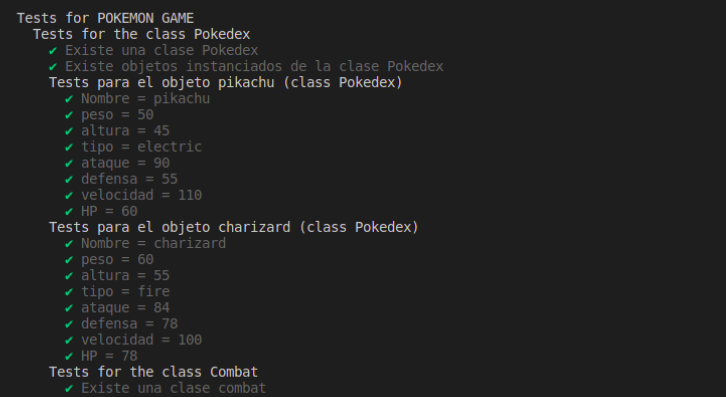

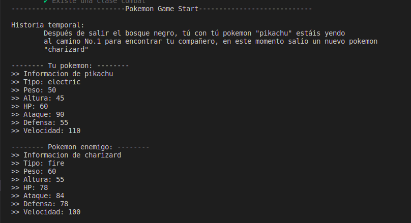 
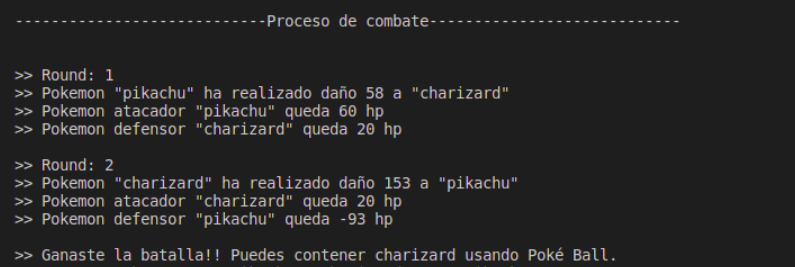

**JUEGO DE CONECT4**

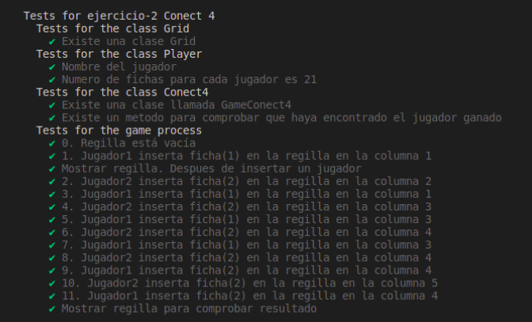

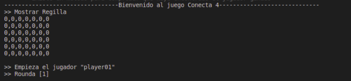
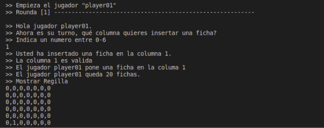
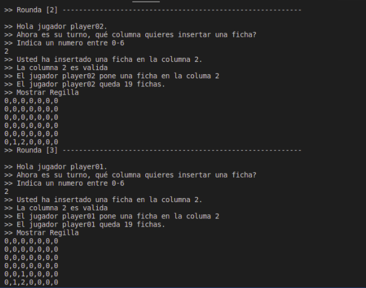
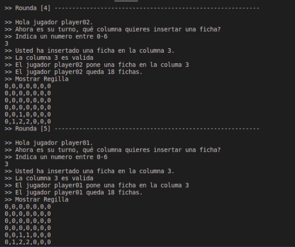
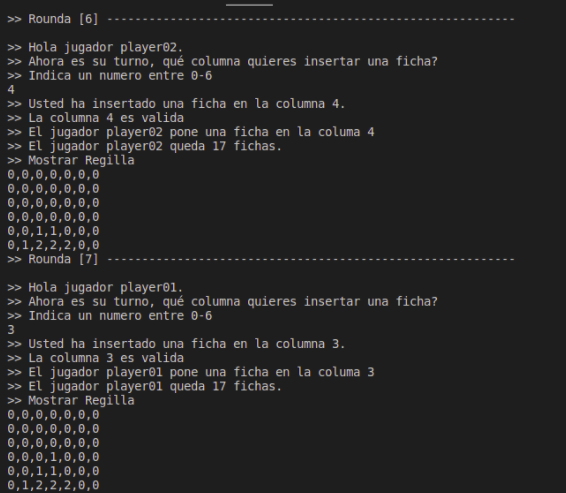
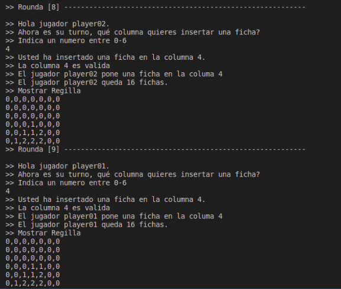
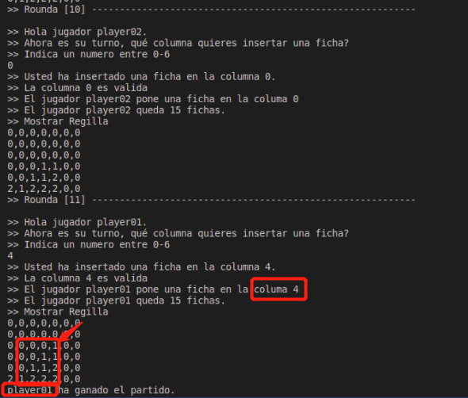
